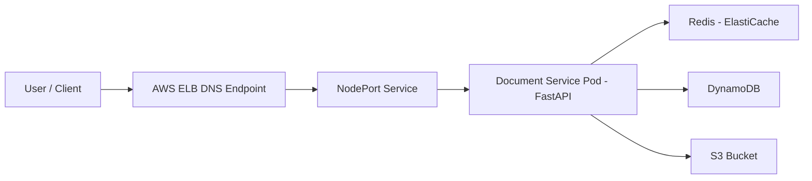

# Document Service – Architecture

## Overview

This project deploys a **Document Service** on AWS using **Kubernetes (EKS)** and an **AWS Elastic Load Balancer (ELB)** created via Terraform.

The API provides:

* `PUT /documents/{id}` → Store document data
* `GET /documents/{id}` → Retrieve document (cache-first)
* `GET /health` → Service & dependency health check

Backend services:

* DynamoDB → persistent storage
* S3 → document content storage (optional based on config)
* Redis (ElastiCache) → caching layer

---

## High-Level Architecture

The application runs on Amazon EKS and is exposed using an AWS Elastic Load Balancer.  
Traffic flows from ELB to Kubernetes NodePort service which routes requests to document-service pods.

The service integrates with:
Redis (ElastiCache) for caching
DynamoDB for metadata storage
Amazon S3 for document storage




## Data Flow Explanation

### Write Path (Store Document)

1. User sends request to ELB endpoint
2. ELB forwards traffic to EKS NodePort service
3. Service routes request to document-service pod
4. Application stores document content in Amazon S3
5. Metadata is stored in DynamoDB
6. Cache entry is updated in Redis

---

### Read Path (Fetch Document)

1. User sends read request to ELB
2. ELB forwards request to EKS service
3. Request reaches document-service pod
4. Application checks Redis cache first
5. If cache hit → data returned immediately
6. If cache miss → fetch from DynamoDB/S3 and update Redis

---

## Storage and Cache Architecture

### Redis (ElastiCache)
Used as in-memory cache to reduce DynamoDB read load and improve response time.

### DynamoDB
Stores document metadata such as document ID, location and attributes.

### Amazon S3
Stores actual document content for durable and scalable storage.

This hybrid approach ensures:
Fast reads via Redis
Reliable structured storage in DynamoDB
Cost efficient file storage in S3
## System Components

### Kubernetes (EKS)

* Deployment – runs document-service pods
* NodePort Service – exposes pods to ELB
* ConfigMap – environment configurations
* IAM Role (Node Role / IRSA) – AWS service access

### AWS Services

* Elastic Load Balancer (ELB)
* Amazon EKS
* DynamoDB
* Amazon S3
* ElastiCache Redis
* IAM

---

## Key Design Decisions

### 1) Storage Choice (S3 + DynamoDB)
**Decision:** Use **S3 for document content** and **DynamoDB for metadata**.

**Why:**
S3 is best for storing large/binary content and is highly durable.
DynamoDB provides fast key-value access for metadata (document_id lookup) and scales automatically.
Separation keeps metadata queries fast while content storage stays cost-effective.

**Trade-off:**
Two-step read (metadata + S3) compared to a single DB read, but caching reduces this impact.

---

### 2) Caching Strategy (Cache-aside)
**Decision:** Use **cache-aside** strategy with Redis (ElastiCache).

**How it works:**
Read: check Redis first → if miss → fetch from DynamoDB/S3 → then store into Redis.
Write: store to S3/DynamoDB first → then update or invalidate Redis.

**Why:**
Simple and common for microservices.
App controls when to cache and when to refresh.
Avoids cache becoming the source of truth.

**Trade-off:**
Cache can become stale if invalidation is missed (mitigated by TTL).

---

### 3) EKS vs ECS
**Decision:** Use **EKS** (Kubernetes) instead of ECS.

**Why:**
Kubernetes gives more flexibility (custom networking, scaling, manifests, portability).
Works well for real-world SRE patterns (health checks, rolling updates, configmaps/secrets).
Easier to extend for ingress/service mesh later if needed.

**Trade-off:**
More operational complexity than ECS, but better learning + production-like setup.

---

### 4) Kubernetes Manifests vs Helm
**Decision:** Use **plain Kubernetes YAML manifests** (not Helm).

**Why:**
Simple setup for assessment / starter template.
Easy to review and understand without Helm templating complexity.
Suitable for smaller deployments.

**Trade-off:**
Helm is better for managing multiple environments & reusable templates; can be added later.

---

### 5) Infrastructure Design Pattern
**Decision:** Infrastructure is created using **Terraform**, following IaC best practices.

**Pattern used:**
Separate infrastructure layer (network/EKS/redis/dynamo/s3) and application layer (k8s manifests).
ELB provides public entrypoint and forwards to EKS service (NodePort routing).

**Why:**
Repeatable deployment and consistent environments.
Easier troubleshooting and scaling.

---

### 6) Security Decisions
**Decisions:**
Redis (ElastiCache) is **private** and reachable only from EKS nodes / VPC.
AWS access is controlled via IAM role (node role or IRSA).
No public access to DynamoDB/Redis; only ELB is public.

**Why:**
Minimize attack surface.
Follow least privilege principles.

---

### 7) Handling Cache Failures
**Decision:** If Redis is down, service continues using DynamoDB/S3.

**Why:**
Cache is an optimization, not a dependency.
Health endpoint can report cache: down but service still works.

**Trade-off:**
Higher latency and higher DynamoDB/S3 calls during cache outage.

---

### 8) Data Durability
**Decision:**
Durability guaranteed via AWS managed services:
  - S3 durability for document content
  - DynamoDB durability for metadata

**Why:**
Data remains safe even if pods restart or nodes fail.
Stateless app pods allow easy scaling and rolling deploys.

---

### 9) Overall Trade-offs
Cache-aside is simpler but needs good invalidation/TTL.
EKS gives flexibility but adds ops complexity.
S3 + DynamoDB is scalable but introduces multi-step read (solved via caching).

## Request Flow (ELB → NodePort → Pod)

1. User accesses the application using **ELB DNS endpoint**

2. ELB forwards traffic to EKS worker nodes

3. ELB target group routes traffic to the configured **NodePort**

4. Kubernetes NodePort forwards request to **document-service pod**

5. Application processes request:

   * Checks Redis cache
   * If cache miss → reads/writes DynamoDB

6. Response flows back:

```
Pod → NodePort → ELB → User
```

---

## Health Check Logic

Endpoint:

```
GET /health
```

Example response:

```json
{
  "status": "healthy",
  "storage": "ok",
  "cache": "ok"
}
```

### Meaning:

| Field   | Description            |
| ------- | ---------------------- |
| status  | Overall service health |
| storage | DynamoDB connectivity  |
| cache   | Redis connectivity     |

If both storage and cache are reachable → service is healthy.

✔️ System components (ELB, EKS, Redis,  S3)
✔️ Request flow (ELB → NodePort → Service → Pod → Redis/S3)
✔️ Why each service used (short)
✔️ Security overview